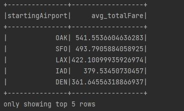
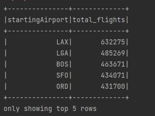

# Flight Dataset Analysis

This is a Spark application written in Scala for analyzing a flight dataset. 
It performs various operations on the dataset, including data cleaning, basic statistics, and aggregation. 
The main purpose of the code is to demonstrate how to use Spark's DataFrame and Dataset API for data analysis.

# Here is the description of each column in the CSV data:

- **legId**: Unique identifier for each leg of the flight.
- **searchDate**: The date when the flight search was performed.
- **flightDate**: The date of the actual flight.
- **startingAirport**: The airport code for the departure airport.
- **destinationAirport**: The airport code for the arrival airport.
- **fareBasisCode**: The fare basis code for the flight.
- **travelDuration**: The total duration of the flight including layovers, in human-readable format.
- **elapsedDays**: The number of days between the search date and the flight date.
- **isBasicEconomy**: Indicates if the fare is for basic economy class (True/False).
- **isRefundable**: Indicates if the fare is refundable (True/False).
- **isNonStop**: Indicates if the flight is non-stop (True/False).
- **baseFare**: The base fare of the flight.
- **totalFare**: The total fare of the flight including taxes and fees.
- **seatsRemaining**: The number of seats remaining on the flight.
- **totalTravelDistance**: The total travel distance of the flight in miles.
- **segmentsDepartureTimeEpochSeconds**: The departure time of each flight segment in epoch seconds.
- **segmentsDepartureTimeRaw**: The departure time of each flight segment in human-readable format.
- **segmentsArrivalTimeEpochSeconds**: The arrival time of each flight segment  in epoch seconds.
- **segmentsArrivalTimeRaw**: The arrival time of each flight segment in human-readable format.
- **segmentsArrivalAirportCode**: The airport code for the arrival airport of each flight segment.
- **segmentsDepartureAirportCode**: The airport code for the departure airport of each flight segment.
- **segmentsAirlineName**: The name of the airline operating each flight segment.
- **segmentsAirlineCode**: The code of the airline operating each flight segment.
- **segmentsEquipmentDescription**: The description of the aircraft used for each flight segment.
- **segmentsDurationInSeconds**: The duration of each flight segment in seconds.
- **segmentsDistance**: The distance of each flight segment  in miles.
- **segmentsCabinCode**: The cabin code for each flight segment (e.g., coach, business, first class).

### Total Number of rows in Dataset 6364153

### Code Overview
Code Overview
The code performs the following operations on the flight dataset:

- Reads the flight dataset from a CSV file into a Spark DataFrame.
- Splits the values in some columns of the DataFrame to create arrays using the split function from the **org.apache.spark.sql.functions** package.
- Drops unnecessary columns from the DataFrame using the **drop** function.
- Converts the DataFrame into a Dataset of case class Flight using the as function.
- Performs basic statistics on numerical columns using the **describe** function.
- Aggregates the data by the segmentsCabinCodeArray column to calculate the average base fare and total fare using the **groupBy** and **agg** functions.
- Defines a user-defined function (UDF) to convert the travelDuration column from string format to seconds using the Duration class from the **java.time package**.
- Registers the UDF using the **udf** function from the org.apache.spark.sql.functions package.
- Applies the registered UDF to the travelDuration column using the **withColumn** function.
- Filters out rows with null values in the segmentsAirlineNameArray and travelDurationSeconds columns using the **filter** function.
- Explodes the segmentsAirlineNameArray column to create a new row for each airline using the **explode** function.
- Performs aggregation on the exploded dataset to calculate the average base fare and total fare by airline using the **groupBy** and **agg** functions.
- Displays the results of the analysis using the show function.

## Exploratory Data Analysis
EDA is the process of exploring and analyzing a dataset to gain insights and understand its characteristics. 
It involves tasks such as checking the data structure, generating statistical summaries, visualizing the data through plots and charts, cleaning the data, creating new features, aggregating the data, and identifying correlations between variables. 
EDA helps in identifying patterns, trends, and relationships within the data, and provides a foundation for further analysis and decision-making. 
It is an iterative process that involves examining the data from different perspectives to uncover valuable insights and draw conclusions.
- Load the Dataset: Load the CSV file into a Spark DataFrame or any other suitable data structure for processing in Spark.

- Check Data Structure: Use Spark's DataFrame API to examine the data structure, including the schema, column names, and data types. This step helps to understand the data's structure and identify any potential issues, such as missing or inconsistent data.

- Statistical Summary: Use Spark's DataFrame API to generate basic statistical summary of the dataset, including measures such as mean, median, standard deviation, minimum, maximum, etc. This helps in understanding the central tendency, spread, and distribution of the numerical variables in the dataset.

- Data Cleaning: Perform data cleaning tasks such as handling missing values, correcting inconsistent or erroneous data, and handling outliers, if any. This step ensures that the data is clean and ready for further analysis.

```    
val spark = SparkSession.builder()
.appName("FlightDatasetAnalysis")
.master("local[*]")
.config("spark.executorEnv.LD_LIBRARY_PATH", "C:\\Program Files\\Hadoop\\bin")
.getOrCreate()
```
The code creates a SparkSession named "FlightDatasetAnalysis" to analyze a flight dataset. It configures Spark to run locally using all available CPU cores, sets a library path for Hadoop, and either gets an existing SparkSession or creates a new one.
```
    val flightDF = spark.read
      .format("csv")
      .option("inferSchema", "true")
      .option("header", "true")
      .option("mode", "per" +
        "missive")
      .load("C:\\Users\\Home PC\\Desktop\\SparkApplication\\itineraries.csv")
```
The code reads a CSV file named "itineraries.csv" which contains the flight data, located on the desktop of a user's home PC using Spark. It infers the schema of the data, treats the first row as the header, and sets the mode to "permissive" for handling any data parsing errors. The loaded data is stored in a DataFrame named "flightDF".

```
    val dfWithSplitValues = flightDF.withColumn("durationInSecondsArray", split(col("segmentsDurationInSeconds"), "\\|\\|"))
      .withColumn("distanceArray", split(col("segmentsDistance"), "\\|\\|"))
      .withColumn("durationInSecondsIntArray", expr("transform(durationInSecondsArray, x -> cast(x as int))"))
      .withColumn("distanceIntArray", expr("transform(distanceArray, x -> cast(x as int))"))
      .withColumn("segmentsCabinCodeArray", split(col("segmentsCabinCode"), "\\|\\|"))
      .withColumn("segmentsEquipmentDescriptionArray", split(col("segmentsEquipmentDescription"), "\\|\\|"))
      .withColumn("segmentsAirlineCodeArray", split(col("segmentsAirlineCode"), "\\|\\|"))
      .withColumn("segmentsAirlineNameArray", split(col("segmentsAirlineName"), "\\|\\|"))
      .withColumn("segmentsDepartureAirportCodeArray", split(col("segmentsDepartureAirportCode"), "\\|\\|"))
      .withColumn("segmentsArrivalAirportCodeArray", split(col("segmentsArrivalAirportCode"), "\\|\\|"))
      .withColumn("segmentsArrivalTimeRawArray", split(col("segmentsArrivalTimeRaw"), "\\|\\|"))
      .withColumn("segmentsArrivalTimeEpochSecondsArray", split(col("segmentsArrivalTimeEpochSeconds"), "\\|\\|").cast(ArrayType(LongType)))
      .withColumn("segmentsDepartureTimeRawArray", split(col("segmentsDepartureTimeRaw"), "\\|\\|"))
      .withColumn("segmentsDepartureTimeEpochSecondsArray", split(col("segmentsDepartureTimeEpochSeconds"), "\\|\\|").cast(ArrayType(LongType)))
```
The code performs multiple transformations on the "flightDF" DataFrame using various functions provided by Spark. It splits certain columns into arrays by splitting the values using the "||" delimiter. It also performs casting of data types for some of the arrays. The resulting DataFrame is named "dfWithSplitValues" and contains several new columns with arrays of values extracted from the original columns in "flightDF".

```
    val cleaneddf = dfWithSplitValues.drop("durationInSecondsArray", "distanceArray", "segmentsDurationInSeconds", "segmentsDistance",
      "segmentsCabinCode", "segmentsEquipmentDescription", "segmentsAirlineCode", "segmentsAirlineName",
      "segmentsDepartureAirportCode", "segmentsArrivalAirportCode", "segmentsArrivalTimeRaw",
      "segmentsArrivalTimeEpochSeconds", "segmentsDepartureTimeRaw", "segmentsDepartureTimeEpochSeconds")
```
This snippet drops several unnecessary columns from the DataFrame named "dfWithSplitValues" using the "drop" method, including "durationInSecondsArray", "distanceArray", "segmentsDurationInSeconds", "segmentsDistance", "segmentsCabinCode", "segmentsEquipmentDescription", "segmentsAirlineCode", "segmentsAirlineName", "segmentsDepartureAirportCode", "segmentsArrivalAirportCode", "segmentsArrivalTimeRaw", "segmentsArrivalTimeEpochSeconds", and "segmentsDepartureTimeRaw", "segmentsDepartureTimeEpochSeconds". The resulting DataFrame named "cleaneddf" is a modified version of "dfWithSplitValues" with these columns removed.


```
case class Flight(legId: String, searchDate: String, flightDate: String, startingAirport: String, destinationAirport: String,
fareBasisCode: String, travelDuration: String, elapsedDays: Int, isBasicEconomy: Boolean,
isRefundable: Boolean, isNonStop: Boolean, baseFare: Double, totalFare: Double, seatsRemaining: Int,
totalTravelDistance: Int, durationInSecondsIntArray: Array[Int], distanceIntArray: Array[Int],
segmentsCabinCodeArray: Array[String], segmentsEquipmentDescriptionArray: Array[String],
segmentsAirlineCodeArray: Array[String], segmentsAirlineNameArray: Array[String],
segmentsDepartureAirportCodeArray: Array[String], segmentsArrivalAirportCodeArray: Array[String],
segmentsArrivalTimeRawArray: Array[String], segmentsArrivalTimeEpochSecondsArray: Array[Long],
segmentsDepartureTimeRawArray: Array[String], segmentsDepartureTimeEpochSecondsArray: Array[Long])
```

```
    val flightsDS = cleaneddf.as[Flight]
```
The code defines a data structure called **Flight** using a case class, which represents flight information with various attributes. Then, it converts a DataFrame named **cleaneddf** into a typed Dataset named "flightsDS" using the **as** method with the **Flight** case class as the type parameter. The resulting "flightsDS" Dataset represents flights data with a schema based on the defined case class, allowing for typed operations and improved type-safety in subsequent data processing.

```
    // Perform basic statistics on numerical columns
    flightsDS.describe("baseFare", "totalFare", "elapsedDays", "seatsRemaining", "totalTravelDistance").show()
```


```
   // Calculate average fare by cabin code
   
    flightsDS.groupBy("segmentsCabinCodeArray")
      .agg(avg("baseFare").alias("avg_baseFare"), avg("totalFare").alias("avg_totalFare"))
      .show()
```
The code calculates the average base fare and total fare for each unique value in the "segmentsCabinCodeArray" column of the "flightsDS" Dataset. It groups the data by "segmentsCabinCodeArray" using the "groupBy" method, and then calculates the average base fare and total fare using the "agg" method with "avg" aggregation function. The resulting averages are then displayed using the "show" method.


```
    def travelDurationFormatting(travelD: String) = {
      val duration = Duration.parse(travelD)
      duration.getSeconds
    }

    //Register the function as UDF
    val registerUDF = udf(travelDurationFormatting _)

    //Apply the udf in column travelDuration
    val formattedDf = flightsDS.withColumn("travelDurationSeconds", registerUDF(col("travelDuration")))

```
The code defines a user-defined function (UDF) named "travelDurationFormatting" that takes a string argument "travelD" in the format "PT2H29M", which represents a duration in hours and minutes. The function uses the Java 8 "Duration" class to parse the duration and extract the total number of seconds.
The UDF is then registered with Spark using the "udf" method, and the "travelDurationFormatting" function is passed as an argument.
Next, the UDF is applied to the "travelDuration" column of the "flightsDS" Dataset using the "withColumn" method, and a new column named "travelDurationSeconds" is created to store the parsed duration in seconds.

```
    // Filter out rows with null values in segmentsAirlineNameArray or travelDuration
    val filteredDF = formattedDf.filter(col("segmentsAirlineNameArray").isNotNull && col("travelDurationSeconds").isNotNull)
```
The code filters out rows from the "formattedDf" DataFrame where either the "segmentsAirlineNameArray" or "travelDurationSeconds" column contains null values. The "isNotNull" method is used to check for null values in these columns. The filtered data is stored in a new DataFrame named "filteredDF".

```
    // Explode the segmentsAirlineNameArray to create a new row for each airline name
    val explodedDF = filteredDF.select("segmentsAirlineNameArray", "travelDurationSeconds")
      .withColumn("airlineName", explode(col("segmentsAirlineNameArray")))
      .filter(col("airlineName").isNotNull) // Filter out rows with null airlineName

    // Calculate average travel duration by airline name
    val resultDF = explodedDF.groupBy("airlineName")
      .agg(avg("travelDurationSeconds").cast(LongType).alias("avg_travelDuration"))
    // Show the result
    resultDF.show()
```
The above code performs the following steps:

- The "segmentsAirlineNameArray" and "travelDurationSeconds" columns are selected from the "filteredDF" DataFrame.
- The "explode" function is used to create a new row for each airline name in the "segmentsAirlineNameArray" column.
- Rows with null values in the "airlineName" column are filtered out using the "isNotNull" method.
- The resulting DataFrame is grouped by the "airlineName" column.
- The "agg" function is used to calculate the average of the "travelDurationSeconds" column, casting it to LongType, and aliasing it as "avg_travelDuration".
- The "resultDF" DataFrame is created to store the calculated average travel duration by airline name.
  

```
    // Calculate the average travel duration by segments airline name
    val avgTravelDurationByAirline = filteredDF.groupBy("segmentsAirlineNameArray")
      .agg(avg("travelDurationSeconds").alias("avg_travelDuration"))
      .orderBy(desc("avg_travelDuration"))
    avgTravelDurationByAirline.show(5)
```
The code calculates the average travel duration for each segments airline name by grouping the data based on the "segmentsAirlineNameArray" column, calculating the average of "travelDurationSeconds" column, and sorting the result in descending order.


```
    // Count number of non-stop flights
    val countF = flightsDS.filter("isNonStop = true").count()
    println("Number of non-stop flights is " + countF)
```
The code filters the "flightsDS" dataset to count the number of flights where the "isNonStop" column is set to true. It then prints the count of such flights using the "println" statement. Essentially, it calculates and displays the number of non-stop flights in the dataset.


```
   // Count number of refundable flights
   val countFilter =  flightsDS.filter("isRefundable = true").count()
    println("Number of refundable flights is " + countFilter)
```


```
    // Calculate the percentage of flights that are basic economy
    val basicEconomyPercentage = parsedData.filter(col("isBasicEconomy") === true)
      .agg((count("*") * 100 / parsedData.count()).alias("basic_economy_percentage"))
      .collect()(0)(0).asInstanceOf[Double]
 println("Percentage of flights that are basic economy is " + basicEconomyPercentage)
```
The code filters the "parsedData" dataset to count the number of flights where the "isBasicEconomy" column is set to true. It then calculates the percentage of such flights by dividing the count by the total number of flights in the dataset, multiplying by 100, and aliasing the result as "basic_economy_percentage". The code then collects the calculated percentage and prints it using the "println" statement. Essentially, it calculates and displays the percentage of flights that are labeled as basic economy in the dataset.
``
Percentage of flights that are basic economy is 6.89
``

```
  // Calculate the average base fare by airline code
    val avgBaseFareByAirline = parsedData.groupBy("segmentsAirlineCodeArray")
      .agg(avg("baseFare").alias("avg_baseFare"))
      .orderBy(desc("avg_baseFare"))
    avgBaseFareByAirline.show(5)
```
It calculates and displays the average base fare for each airline code in the dataset.The code groups the "parsedData" dataset by the "segmentsAirlineCodeArray" column, calculates the average of the "baseFare" column for each group using the "avg" function, aliases the result as "avg_baseFare", and orders the result in descending order by "avg_baseFare". The top 5 results are then displayed using the "show" method.


```
    // Calculate the total number of flights by airline name
    val totalFlightsByAirline = parsedData.groupBy("segmentsAirlineNameArray")
      .agg(count("*").alias("total_flights"))
      .orderBy(desc("total_flights"))
    totalFlightsByAirline.show(5)
```
The code groups the "parsedData" dataset by the "segmentsAirlineNameArray" column, calculates the count of total flights for each airline name using the "count" function, aliases the result as "total_flights", and orders the result in descending order by "total_flights". The top 5 results are then displayed using the "show" method. Essentially, it calculates and displays the total number of flights for each airline name in the dataset


```
  // Calculate the percentage of refundable flights
    val refundableFlightsPercentage = parsedData.filter(col("isRefundable") === true)
      .agg((count("*") * 100 / parsedData.count()).alias("refundable_flights_percentage"))
      .collect()(0)(0).asInstanceOf[Double]
println("The percentage of refundable flights is " + refundableFlightsPercentage)
```
The code calculates the percentage of refundable flights in the "parsedData" dataset and displays the result.
``
The percentage of refundable flights is 9.42
``

```
    // Calculate the percentage of non-stop flights
    val nonStopFlightsPercentage = parsedData.filter(col("isNonStop") === true)
      .agg((count("*") * 100 / parsedData.count()).alias("non_stop_flights_percentage"))
      .collect()(0)(0).asInstanceOf[Double]
    println("The percentage of non-stop flights is" + nonStopFlightsPercentage)
```
The code calculates the percentage of non-stop flights in the "parsedData" dataset and displays the result.
``
The percentage of non-stop flights is 28.98
``

```
    // Calculate the average seats remaining by airline code
    val avgSeatsRemainingByAirline = parsedData.groupBy("segmentsAirlineCodeArray")
      .agg(avg("seatsRemaining").alias("avg_seatsRemaining"))
      .orderBy(desc("avg_seatsRemaining"))
    avgSeatsRemainingByAirline.show(5)
```
The code calculates the average number of seats remaining in flights by airline code, and orders the result in descending order.


```
    // Explode the segmentsAirlineNameArray to create a new row for each airline name
    val explodedAirLineNameDF = filteredDF.select("segmentsAirlineNameArray", "totalTravelDistance")
      .withColumn("airlineName", explode(col("segmentsAirlineNameArray")))
      .filter(col("airlineName").isNotNull) // Filter out rows with null airlineName

    // Calculate the total travel distance by airline name
    val totalTravelDistanceByAirline = explodedAirLineNameDF.groupBy("airlineName")
      .agg(sum("totalTravelDistance").alias("total_travelDistance"))
      .orderBy(desc("total_travelDistance"))
    totalTravelDistanceByAirline.show(5)
```
The code first explodes the segmentsAirlineNameArray to create a new row for each airline name, and then filters out rows with null airline names. Then, it calculates the total travel distance by airline name from the exploded dataframe using groupBy and agg operations, and orders the result in descending order by total travel distance.


```
    // Calculate the average fare by starting airport
    val avgFareByStartingAirport = parsedData.groupBy("startingAirport")
      .agg(avg("totalFare").alias("avg_totalFare"))
      .orderBy(desc("avg_totalFare"))
    avgFareByStartingAirport.show(5)

```
The code calculates the average fare by starting airport by grouping the data by the "startingAirport" column, calculating the average of "totalFare" column using agg operation with avg function, ordering the result in descending order by average total fare, and finally showing the top 5 results using show method.



```
    // Calculate the average fare by destination airport
    val avgFareByDestinationAirport = parsedData.groupBy("destinationAirport")
      .agg(avg("totalFare").alias("avg_totalFare"))
      .orderBy(desc("avg_totalFare"))
    avgFareByDestinationAirport.show(5)
```
The code calculates the average fare by destination airport by grouping the data by the "destinationAirport" column, calculating the average of "totalFare" column using agg operation with avg function, ordering the result in descending order by average total fare


```
   // Calculate the average elapsed days by airline code
    val avgElapsedDaysByAirline = parsedData.groupBy("segmentsAirlineCodeArray")
      .agg(avg("elapsedDays").alias("avg_elapsedDays"))
      .orderBy(desc("avg_elapsedDays"))
    avgElapsedDaysByAirline.show(5)
```
The code calculates the average elapsed days by airline code by grouping the data by "segmentsAirlineCodeArray" column, calculating the average of "elapsedDays" column, ordering the result in descending order by average elapsed days.


```
    // Calculate the total number of flights by starting airport
    val totalFlightsByStartingAirport = parsedData.groupBy("startingAirport")
      .agg(count("*").alias("total_flights"))
      .orderBy(desc("total_flights"))
```
The code calculates the total number of flights by starting airport by grouping the data by "startingAirport" column, counting the occurrences of "*" (all values), aliasing the result as "total_flights", ordering the result in descending order by total flights, and assigning it to the "totalFlightsByStartingAirport" DataFrame.


```
    // Calculate the total number of flights by destination airport
    val totalFlightsByDestinationAirport = parsedData.groupBy("destinationAirport")
      .agg(count("*").alias("total_flights"))
      .orderBy(desc("total_flights"))
```
The code calculates the total number of flights by destination airport by grouping the data by "destinationAirport" column, counting the occurrences of "*" (all values), aliasing the result as "total_flights", and ordering the result in descending order by total flights, assigning it to the "totalFlightsByDestinationAirport" DataFrame.


```
    // Calculate the most common cabin code
    val mostCommonCabinCode = parsedData.groupBy("segmentsCabinCodeArray")
      .agg(count("*").alias("count"))
      .orderBy(desc("count"))
      .limit(1)
```
The code calculates the most common cabin code by grouping the data by "segmentsCabinCodeArray" column, counting the occurrences of "*" (all values), aliasing the result as "count", ordering the result in descending order by count, and limiting the result to 1 row, assigning it to the "mostCommonCabinCode" DataFrame.


```
    // Calculate the most common equipment description
    val mostCommonEquipmentDescription = parsedData.groupBy("segmentsEquipmentDescriptionArray")
      .agg(count("*").alias("count"))
      .orderBy(desc("count"))
      .limit(1)
    mostCommonEquipmentDescription.show(5)
```
The code calculates the most common equipment description by grouping the data by "segmentsEquipmentDescriptionArray" column, counting the occurrences of "*" (all values), aliasing the result as "count", ordering the result in descending order by count, and limiting the result to 1 row, assigning it to the "mostCommonEquipmentDescription" DataFrame.


```
    val mostCommonAirlineName = explodedAirLineName.groupBy("airlineName")
      .agg(count("*").alias("count"))
      .orderBy(desc("count"))
      .limit(1)
```
The code calculates the most common airline name by grouping the "explodedAirLineName" DataFrame by the "airlineName" column, counting the occurrences of "*" (all values), aliasing the result as "count", ordering the result in descending order by count, and limiting the result to 1 row, assigning it to the "mostCommonAirlineName" DataFrame.


```   
    // Calculate the maximum and minimum base fare
    val maxMinBaseFare = parsedData.agg(max("baseFare").alias("max_baseFare"), min("baseFare").alias("min_baseFare"))
    maxMinBaseFare.show(5)
```
The code calculates the maximum and minimum values of the "baseFare" column in the "parsedData" DataFrame and aliases them as "max_baseFare" and "min_baseFare" respectively, and then displays the result.


```
    // Calculate the total number of flights by airline code
    val totalFlightsByAirlineCode = parsedData.groupBy("segmentsAirlineCodeArray")
      .agg(count("*").alias("total_flights"))
      .orderBy(desc("total_flights"))
    totalFlightsByAirlineCode.show(5)
```
The code calculates the total number of flights for each unique "segmentsAirlineCodeArray" value in the "parsedData" DataFrame, aliases the result as "total_flights", and orders the result by descending total flights count.


